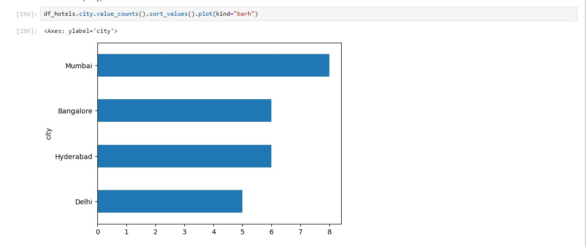
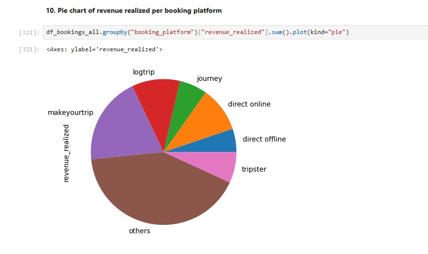

# 📊 Revenue Performance and Demand Insights Analysis

# 🔹 Project Overview
This project focuses on analyzing hospitality data to uncover demand patterns, revenue trends, and business opportunities using Python. The analysis supports data-driven decision-making for pricing optimization, occupancy improvement, and revenue growth.

# 🔹 🧩 Situation
AtliQ Grands, a luxury hotel chain, was experiencing declining market share and revenue due to rising competition and limited adoption of data-driven strategies.

# 🔹 🎯 Task
Analyze historical booking and revenue data to:
- Identify occupancy and demand trends  
- Evaluate revenue performance across cities, hotel types, and platforms  
- Provide actionable insights to improve pricing and occupancy strategies  

# 🔹 ⚙️ Action
- Imported and processed raw datasets using **Python (Pandas, NumPy)**  
- Performed **data cleaning, deduplication, and transformation**  
- Merged multiple datasets and appended new monthly data (August)  
- Conducted **Exploratory Data Analysis (EDA)**  
- Built visualizations using **Matplotlib (bar charts, pie charts)**  

# 🔹 📈 Key Insights
- **Occupancy Rate:** ~58–59% across all room categories (uniform demand)  

### 📍 City Performance
- **Delhi:** Highest occupancy (~62% in June)  
- **Mumbai:** Highest revenue (~668M)  

### 📊 Demand Trend
- Weekend occupancy significantly higher (~72.34%)  

### 💰 Revenue Trends
- Peak revenue observed in **July (~60M)**  
- Luxury hotels contribute highest revenue (~107M)  

### ⭐ Customer Ratings
- Average rating ~3.4–3.7 across cities (scope for improvement)  

### 🌐 Booking Channels
- Revenue distribution varies across platforms  

## 🔹 💡 Business Recommendations
- Implement **dynamic pricing strategy** to capitalize on high weekend demand  
- Increase focus on **Delhi (high demand)** and **Mumbai (high revenue)**  
- Strengthen **luxury segment offerings** to maximize high-margin revenue  
- Optimize **booking platform performance** by prioritizing high-conversion channels  
- Improve **customer experience** to enhance ratings and retention  
- Use **seasonal trends (July peak)** for demand forecasting and resource planning  

## 🔹 🛠️ Tools & Technologies
- Python  
- Pandas  
- NumPy  
- Matplotlib  

## 🔹 🚀 Project Impact
This project demonstrates the ability to:
- Translate raw data into **actionable business insights**  
- Perform **end-to-end EDA workflow**  
- Support **strategic decision-making** in pricing, demand, and revenue optimization  

## 🔹 📌 Conclusion
The analysis highlights key demand drivers and revenue opportunities, enabling AtliQ Grands to adopt data-driven strategies for improving occupancy, pricing efficiency, and overall business performance.
